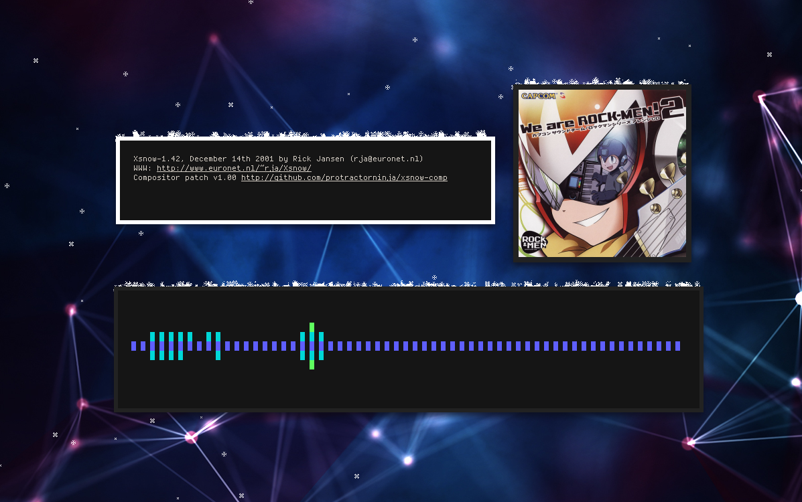

xsnow-comp-patch: Compositor-Friendly Patch for Xsnow
=====================================================

This is a patch that teaches [Rick Jansen's Xsnow 1.42][xsnow] how to play
nicely with manual WM setups that use a standalone compositor like compton.

[xsnow]:http://dropmix.xs4all.nl/rick/Xsnow/

How it works
============

xsnow draws on the X Window System's root window, which compton obscures.  The
patched version creates a new bottom-level window and draws on it instead, but
only if it detects a running compositor or if xsnow is invoked with the
`-nouseroot` flag. The new window uses pure 32-bit black as a background color,
which transparency-enabled compositors should render as transparent.

You may want to use the `-nouseroot` flag if you want xsnow to have
a background color, but you don't want your background to retain that color
when xsnow terminates.

The new window has a class and classname of `xsnow`.

Known Bugs
==========

- The patch changes xsnow's color environment to 32-bit, which appears to be
incompatible with Santa's pixmaps. For now, Santa is automatically disabled if
running with a compositor or `-nouseroot`.
- Trees still work by coincidence, but they're covered in snow.

Compatibility
=============

I have not tested the patch extensively. Please let me know if it works for
your setup.

My testing shows that xsnow-comp-patch works with:

- bspwm + compton
- i3 + compton
- fluxbox + compton

But doesn't work with:

- Unity

Dependencies
============

Library / Program | Ubuntu / Debian |  Arch
----------------- | --------------- | -------
     libx11       |   libx11-dev    | libx11
   libx11-xcb     | libx11-xcb-dev  | libxcb
      libxt       |    libxt-dev    |  libxt
     libxpm       |   libxpm-dev    | libxpm
     libxext      |   libxext-dev   | libxext
      xmkmf       |   xutils-dev    |  imake

Installation
============

With a Package
--------------

### Arch Linux

Install [`xsnow-comp-patch-git`][aur] from the AUR.

[aur]:https://aur.archlinux.org/packages/xsnow-comp-patch-git/

Building from Source
--------------------

1. If you plan to install xsnow-comp-patch to your system, you should remove the
   xsnow package first.

2. Save the latest version of xsnow-comp.patch from this repository.

        mkdir -p /your/builds/xsnow-comp/
        cd /your/builds/xsnow-comp/
        git clone 'this-repository' patch/

3. Download the latest version of xsnow from its homepage and unpack it:

        wget 'http://dropmix.xs4all.nl/rick/Xsnow/xsnow-1.42.tar.gz'
        tar -xzf xsnow-1.42.tar.gz

4. Change into the unpacked xsnow directory and apply the patch:

        cd xsnow-1.42
        cat ../patch/xsnow-comp.patch | patch -p1

5.  Run make and install:

        xmkmf
        make depend
        make
        sudo make install
        sudo make install.man

Licensing
=========

Xsnow has not been released under an open source license, which is why I'm not
hosting the full modified source code for xsnow-comp-patch. Rick Jansen's full
copyright statement follows:

> Xsnow is available freely and you may give it to other people as is,
> but I retain all rights. Therefore it does not classify as 'Public
> Domain' software. It *is* allowed to package Xsnow for Unix/Linux 
> distributions, CD-Roms etc, and to make the necessary changes to
> makefiles etc. to facilitate this.

Please feel free to redistribute this patch however you like. The code I have
added falls under the MIT license, which is included in the patch.

Contributing
============

Once you apply the patch to xsnow, you'll have my development environment. If
you want to contribute, you can file a pull request on GitHub or send patches
to austin@angerson.org.
